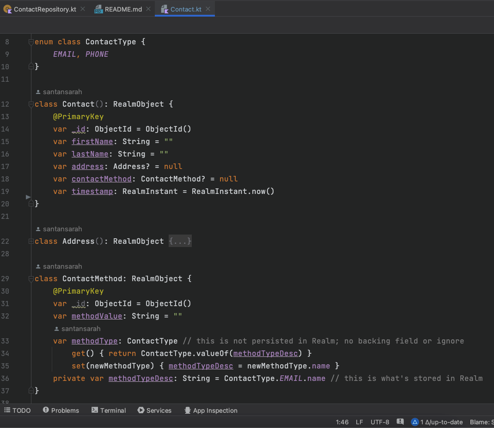

# Realm CRUD Demo

This demo uses Realm to Insert, Update, and Delete contacts. Normally, I use dependency injection
and MVVM, but for this app, I just quickly put something together so I could focus on the Realm
functionality. For a demo of good, scalable architecture, please see my other repos.

